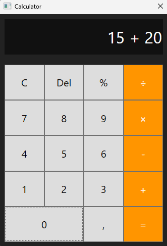

# Simple WPF Calculator
A simple calculator windows desktop application made in about more than 1 hour using WPF and C#.

## Calculation Examples
- 2 + 5 * 2 = 12
- 5 * (10 + 5) = 75
- 20 + 100 / 2 * 4^2 = 820
- 5 + (-2) - (-12) = 15

## 📸 Screenshots

  

